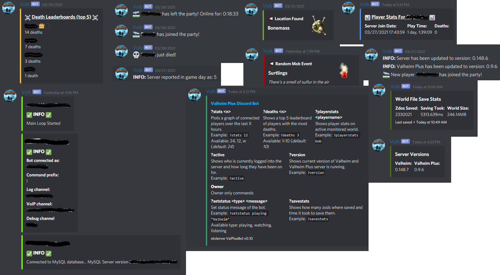

# Valheim Discord Bot

Based off of [stolenvw's ValheimPlus-Discord_Bot](https://github.com/stolenvw/ValheimPlus-Discord_Bot) which in turn is based off of [ckbaudio's valheim-discord-bot](https://github.com/ckbaudio/valheim-discord-bot). Includes support for Valheim Plus.

I'm keeping the original assets and art, all credits go to [ckbaudio](https://github.com/ckbaudio).

## Setup:

- **Working MySQL server is needed for this bot**.
  - `table_info.sql` has table info for the database.
- Install requirements via `pip install -r requirements.txt`.
- The script is intended to run on the same server as the game host for uninterrupted access to server logs.
  - Logs can be invoked on a dedicated valheim server by passing the `-logfile` flag.

### [config.py](code/config.py)

Edit this file with your info. Setting should be self-explanitory.  

**Warning:** Using the `BepInEx/LogOutput.log` file will not work.

For `WORLDSIZE` user running the bot must have read permissions to the world.db.old file.

### [dbsetup.py](code/dbsetup.py)

Tables and data for the MySQL database.  

**Warning: Set up the `config.py` before running this**.
Run `python3 dbsetup.py` from the code dir to create tables.

## Usage:

`python3 plusbot.py` while in the `code` dir.

`nohup python3 plusbot.py &` Too run in background, or you can create a service to run `plusbot.py` under systemd.

**help** shows available commands.

## [Optional:](optional)

Check the optional dir for addons.

## Example Output:

